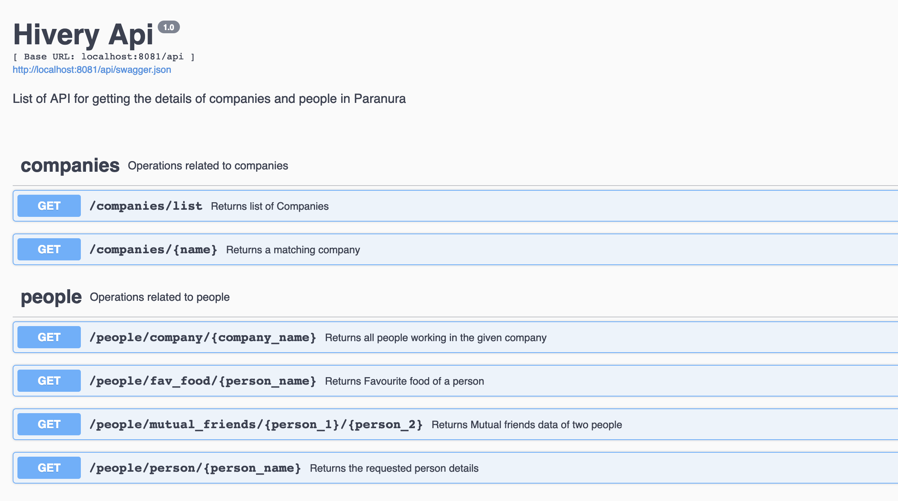
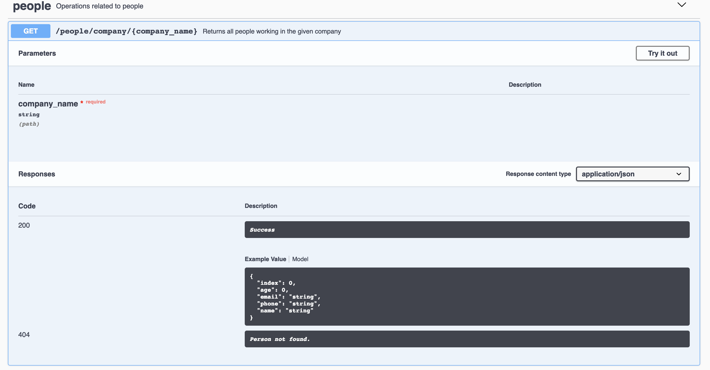
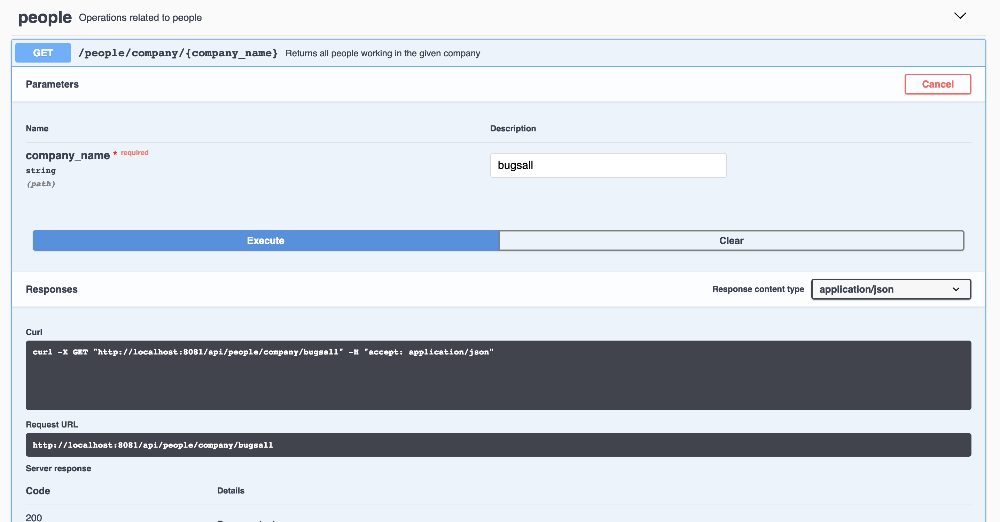
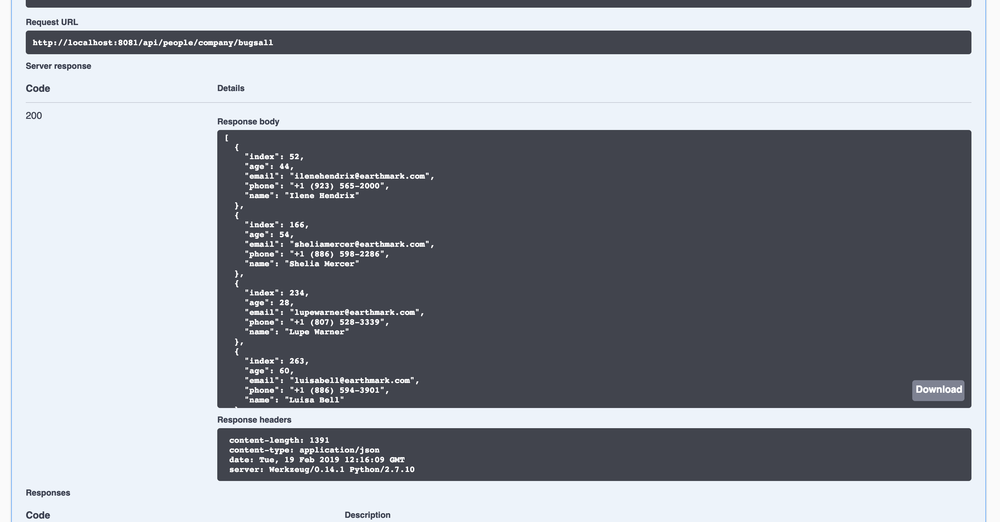

# Paranuara Challenge
Paranuara is a class-m planet. Those types of planets can support human life, for that reason the president of the Checktoporov decides to send some people to colonise this new planet and
reduce the number of people in their own country. After 10 years, the new president wants to know how the new colony is growing, and wants some information about his citizens. Hence he hired you to build a rest API to provide the desired information.

The government from Paranuara will provide you two json files (located at resource folder) which will provide information about all the citizens in Paranuara (name, age, friends list, fruits and vegetables they like to eat...) and all founded companies on that planet.
Unfortunately, the systems are not that evolved yet, thus you need to clean and organise the data before use.
For example, instead of providing a list of fruits and vegetables their citizens like, they are providing a list of favourite food, and you will need to split that list (please, check below the options for fruits and vegetables).

## New Features
Your API must provides these end points:
- Given a company, the API needs to return all their employees. Provide the appropriate solution if the company does not have any employees.
- Given 2 people, provide their information (Name, Age, Address, phone) and the list of their friends in common which have brown eyes and are still alive.
- Given 1 people, provide a list of fruits and vegetables they like. This endpoint must respect this interface for the output: `{"username": "Ahi", "age": "30", "fruits": ["banana", "apple"], "vegetables": ["beetroot", "lettuce"]}`

## Delivery
To deliver your system, you need to send the link on GitHub. Your solution must provide tasks to install dependencies, build the system and run. Solutions that does not fit this criteria **will not be accepted** as a solution. Assume that we have already installed in our environment Java, Ruby, Node.js, Python, MySQL, MongoDB and Redis; any other technologies required must be installed in the install dependencies task. Moreover well tested and designed systems are one of the main criteria of this assessement 

## Evaluation criteria
- Solutions written in Python would be preferred.
- Installation instructions that work.
- During installation, we may use different companies.json or people.json files.
- The API must work.
- Tests

Feel free to reach to your point of contact for clarification if you have any questions.
#Paranuara API
## Installation Instructions
- Checkout the project to your local
- Please make sure **python2.7, mongo db is installed and the db service  is running** 
- Open the terminal in the root directory (hivery-backend-challenge)
- Create a virtual environment using the following command
    `virtualenv .venv`
    
    `source .venv/bin/activate`
    
- After the virtual environment is activated run the `make all` command in the commandline . This command installs all the required dependencies, packages the application, executes the unit tests and on successful completion starts the server in the port `http://localhost:8081/api` , which will open a swagger UI for the paranuara Api

## Running test cases

- To execute the test cases separately run the following command
    `make tests`
    
## Running server

- To run the server seperately run the following command

    `make dev`

## SwaggerUI

- Once the server is started using `make all` or `make dev` command, the swagger UI can be seen in the following URL

    <http://localhost:8081/api/>
    
   
   
- find all the hosted end points in the swagger

- Expand all the given API endpoints to see more details such as input, output response,etc..

   

- To try the API click "Try it out" and enter the details requested

   
- The response for the request can be viewed below
   
   
   
   

##Changing the JSON files:

- Change the files in the `hivery-backend-challenges/app/resources/companies.json` or `hivery-backend-challenges/app/resources/people.json`. But make sure the file name and format is same and it resides in the same folder.

- Once the file is changed execute `make dev` to ensure the new data is loaded into the table and reflected in the service.

**Please feel free to contact me if there are any issues**